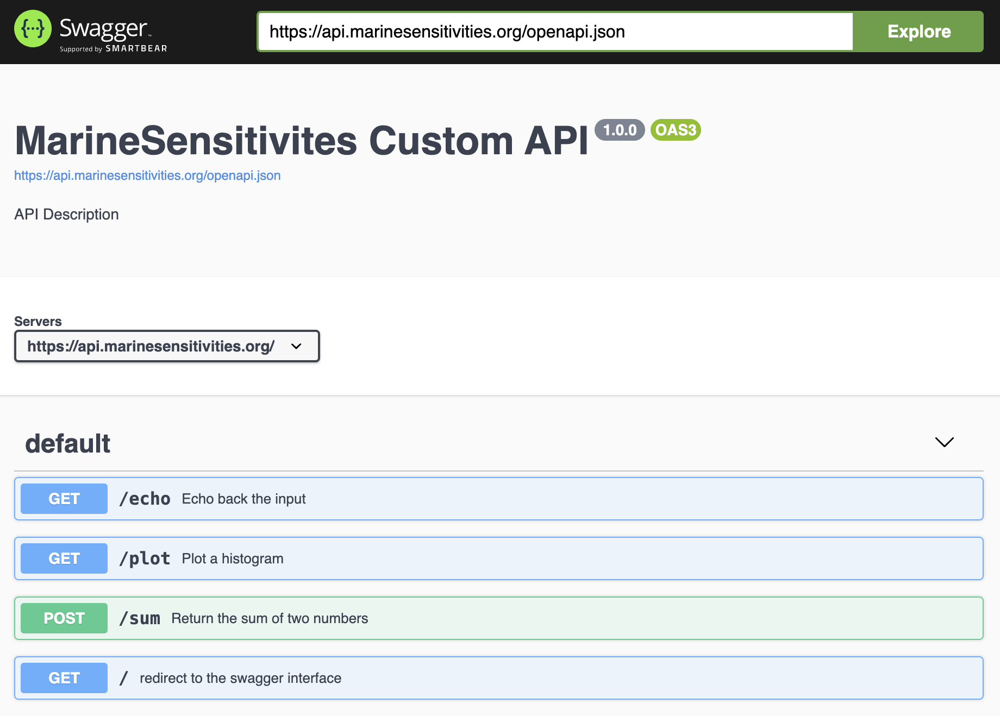

# APIs {#sec-apis}

Two APIs sit in front of the DuckDB source of truth:

1. **[titilecache.marinesensitivity.org](https://titilecache.marinesensitivity.org)** — a custom [TiTiler](https://developmentseed.org/titiler/) factory that renders on-the-fly PNG raster tiles from arbitrary DuckDB SELECTs, cached by Varnish.
2. **[api.marinesensitivity.org](https://api.marinesensitivity.org)** — a custom R [`plumber`](https://www.rplumber.io/) API for programmatic (non-tile) data access.

Static vector data (PMTiles) is served directly by Caddy's file server and doesn't need an API in the traditional sense — see @sec-server.

## msens TiTiler factory

The factory is a FastAPI subclass of `titiler.core.factory.TilerFactory`, registered at the `/msens` prefix on top of the default TiTiler application. It runs in the `titiler` container (image built from `server/titiler/`) and is fronted by a Varnish cache (`titilecache`).

Source: [server/titiler/factory.py](https://github.com/MarineSensitivity/server/blob/main/titiler/factory.py).

### Endpoints

All `/msens/*` routes accept a `sql` query parameter: a **base64url-encoded SELECT** returning exactly two columns, `cell_id` (integer) and `value` (numeric). The SQL is parsed with `sqlglot` (SELECT-only, no write ops, no dynamic I/O like `read_*` / `httpfs` / `load_*`), executed against a read-only DuckDB connection, and the resulting `cell_id → value` map is cached in-process with an LRU keyed on the canonical SQL string. A `mtime` parameter can be passed for cache-busting (typically the mtime of `sdm.duckdb`).

| Endpoint | Purpose |
|---|---|
| `GET /msens/bounds` | Geographic (EPSG:4326) bounds of the cell-id COG. |
| `GET /msens/statistics?sql=…` | `{n, min, max, mean, std, p2, p50, p98}` of the SQL result — used by clients to set a stable legend rescale without fetching any tiles. Cached by Varnish. |
| `GET /msens/tilejson.json?sql=…&colormap=…&rescale=…` | TileJSON 2.2.0 document with the tile URL template — lets any TileJSON-aware client (QGIS, MapLibre, Mapbox GL) consume the layer. |
| `GET /msens/tiles/{z}/{x}/{y}.png?sql=…&colormap=…&rescale=…` | The tile endpoint. Renders a 256×256 RGBA PNG by: (a) executing the SQL and LRU-caching the `cell_id → value` map; (b) reading the z/x/y window of the cell-id COG with nearest-neighbor resampling; (c) looking the value up per pixel, rescaling and colorizing; (d) returning PNG with `Cache-Control: public, max-age=604800`. |
| `GET /msens/tiles/{z}/{x}/{y}.png?sql=…&color=#rrggbb[aa]` | **Single-color mask** variant: every valid (in-range, finite-value) pixel is painted with the given hex color; `colormap` and `rescale` are ignored. Used for binary overlays like "cells outside Program Areas". |
| `GET /msens/debug/cog` | Inspect the underlying cell-id COG (bounds, CRS, dtype, nodata, overviews, `rio_tiler` / `rasterio` versions). |
| `GET /msens/debug/tile/{z}/{x}/{y}` | Inspect what `rio_tiler.Reader.tile()` returns for a given tile (cell-id range, mask valid-pixel count, top-10 cell-ids by count). |

A typical Scores Shiny app composes tile URLs via [`msens::cell_tile_url()`](https://marinesensitivity.org/msens/reference/cell_tile_url.html) and fetches stats via [`msens::cell_stats()`](https://marinesensitivity.org/msens/reference/cell_stats.html); see @sec-libraries.

### Caching

[Varnish](https://varnish-cache.org) fronts the factory at `titilecache:6082`. The custom VCL (`server/varnish/titiler.vcl`):

- Normalizes query-param order via `std.querysort()` so semantically-identical URLs share a cache entry.
- Strips `Cookie` / `Authorization` (the factory is stateless).
- Caches 2xx responses on `/msens/(tiles/|tilejson|bounds|statistics)` for 7 days (`grace=1h`, `keep=24h`); errors for 60 s to prevent stampede.
- Adds `X-Cache: HIT | MISS` for debugging.

When the source DuckDB regenerates, the Shiny app bumps the `mtime` query parameter to invalidate all cached tiles at once.

### Derived COG: `r_cellid.tif`

The factory looks values up against a single-band uint32 cell-id COG at `/share/data/derived/r_cellid.tif`. This file is rebuilt by a one-shot script (`server/titiler/scripts/make_cellid_cog.py`) any time the grid definition changes. See @sec-workflows for details.

## Custom plumber API

The plumber API at [api.marinesensitivity.org](https://api.marinesensitivity.org) covers non-tile use cases — CSV exports, species lookups by feature, on-demand PDF/DOCX report generation. Source: [MarineSensitivity/api](https://github.com/MarineSensitivity/api/blob/main/plumber.R).

{width=300}

## Legacy APIs (deprecated)

The following APIs were part of the pre-2026 PostgreSQL-backed stack and are **no longer in the critical path** for `scores` / `species` apps. Endpoints remain reachable for backward compatibility with legacy apps (`indicators`, `bird_hotspots`) but should not be targeted by new code.

- `swagger.marinesensitivity.org` — PostgREST over the PostgreSQL DB (currently commented out in `docker-compose.yml`).
- `tile.marinesensitivity.org` — `pg_tileserv` vector tiles from PostGIS. Superseded by static PMTiles served by Caddy's `file` subdomain; see @sec-software.
