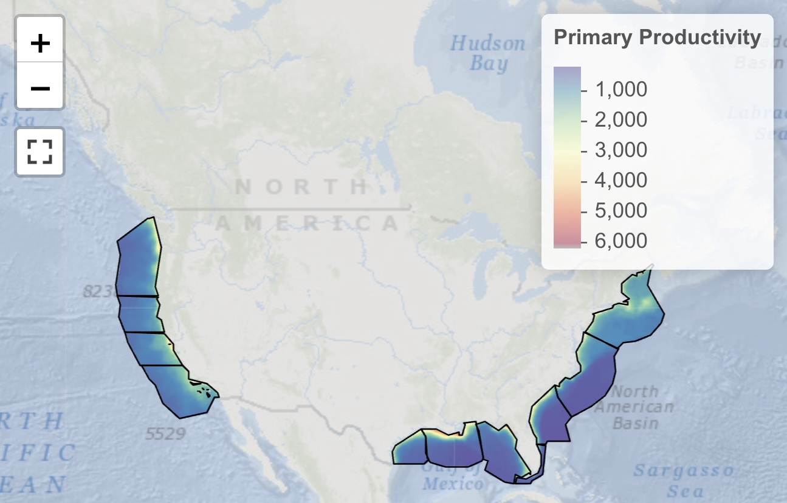

# Data Sources {#sec-data-sources}

The MST integrates species distribution data from 8 source datasets plus 1 derived merged dataset, all stored in a DuckDB database at 0.05° resolution (~4 km cells). Each dataset provides spatial predictions of species occurrence, ranging from continuous suitability models (AquaMaps) to habitats associated with a core area, critical habitat or distinct population segment (NMFS, FWS, SWOT+DPS) to those based on simple range maps (BirdLife, IUCN, FWS).

## Dataset Overview

@tbl-datasets summarizes all 9 datasets in the MST database.

| Dataset Key | Display Name | Cell Value Encoding | Is Mask | Sort |
|:------------|:-------------|:--------------------|:--------|-----:|
| `am_0.05`   | AquaMaps SDM | Continuous suitability 0--100% | No | 1 |
| `ca_nmfs`   | NMFS Core Area | Core: 100% | Yes | 2 |
| `ch_nmfs`   | NMFS Critical Habitat | EN: 100%, TN: 50% | Yes | 3 |
| `ch_fws`    | FWS Critical Habitat | EN: 100%, TN: 50% | Yes | 4 |
| `rng_fws`   | FWS Range | EN: 100%, TN: 50%, LC: 1% | Yes | 5 |
| `bl`        | BirdLife Range | CR: 50%, EN: 25%, VU: 5%, NT: 2%, LC: 1% | Yes | 6 |
| `rng_iucn`  | IUCN Range | CR: 50%, EN: 25%, VU: 5%, NT: 2%, LC: 1% | Yes | 7 |
| `rng_turtle_swot_dps` | SWOT+DPS Turtle Range | EN: 100%, TN: 50% | Yes | 8 |
| `ms_merge`  | Merged Model | MAX across source datasets | No | 0 |

: Summary of the 9 datasets in the MST database. Cell values represent species presence probability or suitability as a percentage (1--100%). Datasets marked `Is Mask = Yes` can also serve as spatial masks during model merging. {#tbl-datasets}

The **sort order** determines priority during model merging: datasets with continuous predictions (AquaMaps) are considered first, followed by progressively coarser range maps. The merged model (`ms_merge`) takes the MAX value across all available source datasets for each species in each cell.

## Source Datasets

### AquaMaps SDM (`am_0.05`) {#sec-aquamaps}

[AquaMaps](https://www.aquamaps.org) provides standardized species distribution models (SDMs) for over 17,000 marine species based on environmental envelope models [@kaschner2019]. Each species model defines habitat suitability as a function of depth, temperature, salinity, primary productivity, ice concentration, and distance from land.

- **Species count**: ~17,550 models
- **Native resolution**: 0.5° (c-squares), downscaled to 0.05° using bilinear interpolation
- **Cell values**: continuous suitability from 0--100%
- **Coverage**: global ocean

AquaMaps serves as the foundational dataset for most species, providing the highest spatial resolution and broadest taxonomic coverage.

### NMFS Core Area (`ca_nmfs`) {#sec-nmfs-core}

Core areas delineated by the National Marine Fisheries Service [NMFS; @nmfs_core2019] identify regions of concentrated use for species under NMFS jurisdiction.

- **Species count**: limited to species with designated core areas
- **Cell values**: 100% within core area boundaries
- **Role**: contributes to merged model as a mask dataset

### NMFS Critical Habitat (`ch_nmfs`) {#sec-nmfs-ch}

Critical habitat designated under the Endangered Species Act (ESA) by NMFS for marine species [@nmfs_ch2025].

- **Species count**: 34 species
- **Cell values**: Endangered species = 100%, Threatened species = 50%
- **Role**: dual function — contributes cell values AND forms part of the spatial mask for model merging

### FWS Critical Habitat (`ch_fws`) {#sec-fws-ch}

Critical habitat designated under the ESA by the U.S. Fish and Wildlife Service [FWS; @fws_ch2025] for marine and coastal species.

- **Species count**: 29 species
- **Cell values**: Endangered species = 100%, Threatened species = 50%
- **Role**: dual function — contributes cell values AND forms part of the spatial mask

### FWS Range (`rng_fws`) {#sec-fws-range}

Current range maps maintained by FWS for ESA-listed marine and coastal species [@fws_range2025].

- **Species count**: 106 species
- **Cell values**: Endangered = 100%, Threatened = 50%, Least Concern = 1%
- **Role**: mask dataset, providing spatial extent for species not covered by AquaMaps

### BirdLife Range (`bl`) {#sec-birdlife}

Expert-reviewed range maps from [BirdLife International's Birds of the World](https://www.birdlife.org) [BOTW; @birdlife2024] dataset, representing the most authoritative global seabird distribution data.

- **Species count**: 573 seabird species
- **Cell values**: scaled by IUCN Red List category — CR: 50%, EN: 25%, VU: 5%, NT: 2%, LC: 1%
- **Role**: mask dataset, providing spatial constraints for seabird species
- **Note**: BirdLife range maps are expert-delineated polygons; cell values reflect conservation status rather than habitat suitability

### IUCN Range (`rng_iucn`) {#sec-iucn-range}

Range maps from the [IUCN Red List of Threatened Species](https://www.iucnredlist.org) spatial data [@iucn2025], covering a broad array of marine taxa.

- **Cell values**: scaled by IUCN Red List category — CR: 50%, EN: 25%, VU: 5%, NT: 2%, LC: 1%
- **Role**: mask dataset, providing spatial extent for species with IUCN range data

### SWOT+DPS Turtle Range (`rng_turtle_swot_dps`) {#sec-swot-dps}

Sea turtle distributions from the original AquaMaps and IUCN range maps were overly broad, extending well beyond where species actually occur. Furthermore, several sea turtle species have differential ESA protection across their range according to NOAA Fisheries Distinct Population Segments (DPS).

This dataset replaces the IUCN range map as the **global spatial mask** for all 6 sea turtle species. It combines two data sources:

- **SWOT Global Distributions** from the [State of the World's Sea Turtles](https://www.seaturtlestatus.org/online-map-data) [@wallace2023], which define more realistic species range polygons.
- **NMFS Distinct Population Segments** (DPS) from NOAA Fisheries ArcGIS Feature Services, which identify sub-populations listed as Endangered under the ESA.

For species with DPS data (Loggerhead CC, Green CM, Olive Ridley LO): Endangered DPS areas are coded at 100%, and the remainder of the SWOT range is coded as Threatened at 50%. For purely Endangered species (Leatherback DC, Hawksbill EI, Kemp's Ridley LK): the entire SWOT range is coded at 100%.

- **Species count**: 6 sea turtle species
- **Cell values**: Endangered = 100%, Threatened = 50%
- **Role**: mask dataset — replaces `rng_iucn` as the global mask for turtles, producing more restrictive distributions dominated by ESA risk values
See workflow: [ingest_turtles-swot-dps](https://marinesensitivity.org/workflows/ingest_turtles-swot-dps.html).

## Merged Model (`ms_merge`)

The merged model is the derived output of the model merging pipeline (see @sec-model-merging). For each of the 9,819 valid species, cell values are computed as:

1. **MAX** across all source dataset values for that species in each cell
2. **Masked** to the spatial extent defined by IUCN, NMFS CH, and FWS CH ranges (when available)
3. **Floored** at minimum values for MMPA-protected species (20%) and MBTA-protected species (10%)

## Standard Grid

All datasets are aligned to a standard **0.05° × 0.05°** latitude-longitude grid covering US waters within BOEM Program Areas. At mid-latitudes, each cell represents approximately 4 × 4 km (16 km²). The grid is stored as a reference raster with unique `cell_id` values, enabling efficient joins between spatial data and tabular attributes in DuckDB.

## Primary Productivity {#sec-primary-productivity}

Primary productivity is specified in the explicit mandate for BOEM's management, per the Outer Continental Shelf Lands Act (OCSLA), Section 18(a)(2) of the OCSLA Amendments of 1978 specifying 8 factors the USDOI must consider in the timing and location of OCS oil and gas activities, including "the relative environmental sensitivity and marine productivity of different areas of the OCS."

We use satellite-derived net primary productivity (NPP) from the Vertically Generalized Production Model [VGPM; @behrenfeld1997] product from [Oregon State's Ocean Productivity Lab](http://sites.science.oregonstate.edu/ocean.productivity), based on VIIRS satellite data for 2014--2023. Values are converted to metric tons C km^-2^ yr^-1^ and averaged across the time period.

{#fig-vgpm}
