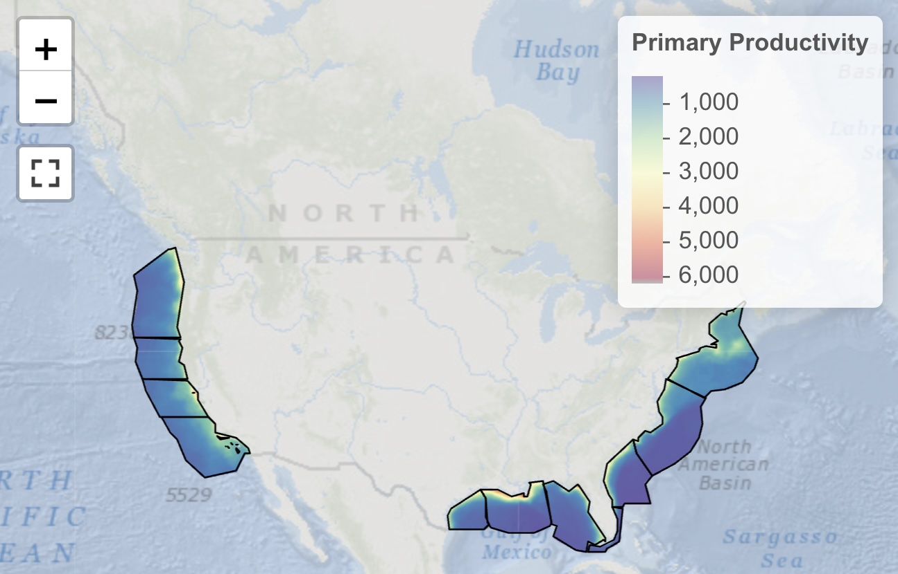

# Data Sources {#sec-data-sources}

```{r}
#| include: false
library(dplyr)

ds  <- doc_datasets()
mdl <- tryCatch(doc_tbl("model", "SELECT ds_key, count(*) AS n_models FROM model GROUP BY 1"),
                error = function(e) NULL)
if (!is.null(mdl)) ds <- left_join(ds, mdl, by = "ds_key")

col <- function(d, nm, default = NA) if (nm %in% names(d)) d[[nm]] else rep(default, nrow(d))
lbl <- function(d) coalesce(as.character(col(d, "name_display")), as.character(col(d, "name_short")))

# datasets that actually fed the scores, excluding the merged output itself
src    <- ds |> filter(is_scored, ds_key != "ms_merge")
# registered but unused: ingested and catalogued, contributing to no score
unused <- ds |> filter(!is_scored)
```

```{r}
#| label: ds-lead
#| output: asis

# Lead with the SHAPE of the integration, not just the count. "Five source
# datasets" is true of v1 and gives entirely the wrong impression, because two of
# them carry ~99.7% of the species and the other three cover a few dozen taxa
# between them.
nv0  <- doc_stats()$valid_species
tops <- src[order(-coalesce(src$n_taxa, 0)), ]
cat("The MST integrates species distributions from **", nrow(src), " source datasets**",
    if (nrow(src) > 1 && !is.na(nv0) && !is.na(tops$n_taxa[1]))
      sprintf(", though not in equal measure — `%s` alone supplies the distribution of %.0f%% of this release's valid species",
              tops$ds_key[1], 100 * tops$n_taxa[1] / nv0) else "",
    ". Each source predicts where a species occurs, and they differ in kind: continuous ",
    "suitability models, habitats tied to a core area, critical habitat or distinct population ",
    "segment, and expert range maps.\n\n", sep = "")
```

::: {.callout-note}
The counts and citations on this page are read from **`r doc_ver()`**'s own published `dataset` table, so they describe that release rather than the current one. Earlier releases integrated fewer sources: the table below *is* the answer for this version.
:::

## Dataset overview

```{r}
#| label: tbl-datasets
#| tbl-cap: !expr paste0("Source datasets in ", doc_ver(), ", ordered by merge priority. *Mask* datasets constrain a taxon's merged distribution to its known range as well as contributing values. *Taxa* is how many of this release's valid species the dataset actually supplied a model for — not how many models it registered.")

n_valid <- doc_stats()$valid_species
tab <- ds |> filter(is_scored, ds_key != "ms_merge")
tab <- tab[order(coalesce(as.numeric(col(tab, "sort_order")), 99)), ]
knitr::kable(
  data.frame(
    `Dataset key` = paste0("`", tab$ds_key, "`"),
    Name          = lbl(tab),
    `Cell values` = coalesce(as.character(col(tab, "value_info")), ""),
    Mask          = ifelse(is.na(col(tab, "is_mask")), "—", ifelse(col(tab, "is_mask"), "Yes", "No")),
    Taxa          = ifelse(is.na(tab$n_taxa), "—", n_fmt(tab$n_taxa)),
    `Share`       = ifelse(is.na(tab$n_taxa) | is.na(n_valid), "—",
                           ifelse(tab$n_taxa / n_valid < 0.001, "<0.1%",
                                  sprintf("%.1f%%", 100 * tab$n_taxa / n_valid))),
    check.names = FALSE, row.names = NULL),
  align = c("l", "l", "l", "c", "r", "r"))
```

```{r}
#| label: ds-coverage
#| output: asis

# The row COUNT is the misleading number, and it is what this page used to lead
# with: v1 registers five source datasets, but two of them supply essentially
# every scored species and the other three together reach a few dozen. The Taxa
# column above carries that; this names it, because a reader comparing releases
# is really comparing coverage, not row counts.
#
# Deliberately NOT phrased as "pilot": a dataset can be small because it is
# TARGETED and complete. rng_turtle_swot_dps covers 6 taxa because there are six
# sea turtle species, and ca_nmfs covers 1 by design — calling either a pilot
# would be wrong.
if (!is.na(n_valid) && any(!is.na(tab$n_taxa))) {
  broad  <- tab[!is.na(tab$n_taxa) & tab$n_taxa / n_valid >= 0.01, ]
  narrow <- tab[!is.na(tab$n_taxa) & tab$n_taxa / n_valid <  0.01, ]
  cat("::: {.callout-important}\n## Coverage is very uneven — read the *Taxa* column, not the row count\n\n")
  if (nrow(broad)) cat(
    "**Broad coverage.** ", paste0("`", broad$ds_key, "` (", n_fmt(broad$n_taxa), ")",
                                   collapse = ", "),
    " — between them these account for the distribution of essentially every scored species.\n\n",
    sep = "")
  if (nrow(narrow)) cat(
    "**Targeted designations.** ", paste0("`", narrow$ds_key, "` (", n_fmt(narrow$n_taxa), ")",
                                          collapse = ", "),
    " — each under 1% of valid species. These are legal designations and expert ranges for ",
    "specific taxa (critical habitat, core areas, sea turtle ranges), so they are small by ",
    "nature rather than incomplete; they raise the value of the cells they cover rather than ",
    "extending coverage to new species.\n\n", sep = "")
  cat(":::\n\n")
}
```

```{r}
#| label: ds-unused
#| output: asis

# Registered is not used. Saying so here is the difference between "9 datasets"
# and "9 datasets, 8 of which produced the numbers on every other page."
if (nrow(unused)) cat(
  "::: {.callout-important}\n## Registered but not scored\n\n",
  doc_ver(), " also catalogues ",
  paste0("**", lbl(unused), "** (`", unused$ds_key, "`)", collapse = " and "),
  ". These are ingested and published, but they are **not** part of the merge and contribute to no score — ",
  "their density units (individuals km^-2^) have no agreed mapping onto the 0--100 suitability scale the ",
  "merge operates on. They are excluded from every count on this page, and from `dataset.is_scored`.\n:::\n",
  sep = "")
```

The **merged model** (`ms_merge`) is the derived output rather than a source, so it is excluded from the table above: for each taxon it takes the maximum value across that taxon's source datasets in each cell, constrained to the taxon's expert range where one exists (see @sec-model-merging).

```{r}
#| label: ds-merge-role
#| output: asis

# How much merging a release actually did is itself a defining fact, and it is
# NOT constant: v1 merged only the handful of taxa that had more than one source,
# so most scored species carried their source model directly. From v3 the merge
# runs for every taxon, and the scored surface is entirely ms_merge.
mrg <- ds$n_taxa[ds$ds_key == "ms_merge"]
if (length(mrg) == 1 && !is.na(mrg) && !is.na(n_valid)) {
  frac <- mrg / n_valid
  cat("In ", doc_ver(), " the merged model covers **", n_fmt(mrg), "** of the ", n_fmt(n_valid),
      " valid species (", sprintf("%.0f%%", 100 * frac), "). ", sep = "")
  if (frac > 0.99)
    cat("Every scored species goes through the merge, so the scored surface is the merged ",
        "model throughout.\n\n", sep = "")
  else
    cat("The remainder carry a single source model directly — this release merges only where a ",
        "taxon has more than one contributing dataset, so most species are scored straight from ",
        "their source.\n\n", sep = "")
}
```

## The sources

```{r}
#| label: ds-sections
#| output: asis

# Generated from the registry, so a dataset cannot be described here with a
# vintage, citation or link the release does not actually carry. The
# interpretive notes that follow are hand-written, because *why* a dataset is
# used the way it is is not a fact any table holds.
fmt_link <- function(url, text) if (is.na(url) || !nzchar(url)) NULL else
  sprintf("[%s](%s)", text, url)

for (i in order(coalesce(as.numeric(col(src, "sort_order")), 99))) {
  d <- src[i, ]
  cat("\n### ", lbl(d), " (`", d$ds_key, "`)\n\n", sep = "")

  desc <- as.character(col(d, "description"))
  if (!is.na(desc) && nzchar(desc)) cat(desc, "\n\n", sep = "")

  bits <- c(
    if (!is.na(col(d, "n_models"))) sprintf("**Models**: %s",
      formatC(as.numeric(col(d, "n_models")), format = "d", big.mark = ",")),
    if (!is.na(col(d, "response_type"))) sprintf("**Response**: %s", col(d, "response_type")),
    if (!is.na(col(d, "value_info")) && nzchar(as.character(col(d, "value_info"))))
      sprintf("**Cell values**: %s", col(d, "value_info")),
    if (!is.na(col(d, "regions"))) sprintf("**Coverage**: %s", col(d, "regions")),
    if (!is.na(col(d, "taxa_groups"))) sprintf("**Taxa**: %s", col(d, "taxa_groups")),
    if (!is.na(col(d, "is_mask"))) sprintf("**Role**: %s",
      if (isTRUE(col(d, "is_mask"))) "contributes values **and** constrains the merged range"
      else "contributes values"))
  if (length(bits)) cat("- ", paste(bits, collapse = "\n- "), "\n\n", sep = "")

  cit <- as.character(col(d, "citation"))
  if (!is.na(cit) && nzchar(cit)) cat("> ", cit, "\n\n", sep = "")

  links <- Filter(Negate(is.null), list(
    fmt_link(as.character(col(d, "link_info")),     "Source"),
    fmt_link(as.character(col(d, "link_download")), "Download"),
    fmt_link(as.character(col(d, "link_metadata")), "Metadata")))
  if (length(links)) cat(paste(unlist(links), collapse = " · "), "\n\n")
}
```

## Notes on individual sources

### AquaMaps vintage

AquaMaps is the foundational dataset for most taxa: environmental-envelope models of habitat suitability as a function of depth, temperature, salinity, primary productivity, ice concentration and distance from land [@kaschner2019]. The **model vintage is AquaMaps Version 10/2019** — the release named in the citation above, and the one the registry records as its environmental end date. Later dates that appear alongside AquaMaps in project records are *retrieval* dates for that same 2019 release, not a newer one; the underlying suitability surfaces have not changed.

Models are native to a 0.5° grid (c-squares) and are interpolated onto the analysis grid **bilinearly**, implemented as a precomputed weight join rather than a per-species raster resample. Source cells that are absent contribute zero, so a distribution fades to zero within about one cell of its edge rather than ending on a hard step.

```{r}
#| label: aquax-note
#| output: asis

# rendered only for releases that carry the dataset -- a v8 book must not describe v9's inputs
if ("ax" %in% ds$ds_key) cat('
### AquaX supersedes AquaMaps in US waters

**AquaX** [@reygondeau2026] is an enhanced and revised AquaMaps framework: for each species, a
ten-algorithm ensemble of habitat suitability, cropped to the species\' biogeographic range. The
delivery used here is **native to the analysis grid** (0.05°, the same lattice as this release\'s
cells, so each pixel *is* a cell — no interpolation) and **masked to US waters**: it covers the
BOEM study-area polygon and nothing beyond it. Values are the present-day ensemble mean on a
0–1000 scale, divided by 10 to sit on AquaMaps\' 0–100 scale; the model\'s TSS threshold (`cutoff`)
and skill (`AUC`, `TSS`) are carried as metadata but the threshold is **not** applied, matching how
AquaMaps has always been used.

Because AquaX is a newer model of the same quantity, it **supersedes AquaMaps for the same
species wherever AquaX was modeled**. The rule is per species and inside AquaX\'s own mask only:
a superseded species\' AquaMaps cells inside the mask are removed *before* the merge, so an AquaX
absence is an absence rather than an AquaMaps presence showing through; outside the mask — the
rest of the world — AquaMaps continues unchanged. Species AquaX did not model keep AquaMaps everywhere. Species AquaX modeled
but predicted *absent* from US waters keep their AquaMaps surface in this pre-release; that is a
question for review, and it is a switch in the pipeline rather than a silent default.

In the species app both inputs sit side by side. AquaMaps offers *Original* (its native 0.5°
cells) and *Interpolated* (the 0.05° surface used in scoring). AquaX needs no interpolation, so its
two views are *Delivered* (the 0–1000 band exactly as received) and *As ingested* (÷10, integer
1–100, and — like AquaMaps — pixels below suitability 1 dropped; roughly half of a typical AquaX
model\'s pixels are near-zero and fall below that line). Toggling between them shows the effect of
the ingest threshold itself, which is why the second view is published rather than aliased.

')
```

### Sea turtles: why a dedicated range dataset

Sea turtle distributions from AquaMaps and from IUCN range maps were both too broad, extending well beyond where the species actually occur. Several species also carry **different ESA protection in different parts of their range**, through NOAA Fisheries Distinct Population Segments (DPS) — which a single global range map cannot express.

The SWOT+DPS dataset replaces the IUCN range as the global mask for all six sea turtle species, combining SWOT Global Distributions [@wallace2023] for realistic range polygons with the NOAA Fisheries ESA Species Range Geodatabase [@noaafisheries2025dps] for DPS listing status. Where DPS data exist (Loggerhead, Green, Olive Ridley), Endangered DPS areas take the Endangered value and the remainder of the SWOT range the Threatened value; for species Endangered throughout (Leatherback, Hawksbill, Kemp's Ridley) the entire range takes the Endangered value.

### Range maps as masks

Datasets marked *Mask* do double duty: they contribute cell values **and** define the spatial extent a taxon's merged distribution may occupy. This is what stops an environmental-envelope model from asserting presence far outside a species' known range — see @sec-model-merging.

## Standard grid

```{r}
#| label: grid-spec
#| output: asis

# from the GRID REGISTRY, not the manifest's own copy: only v8 embeds a `grid`
# block, so reading the manifest alone leaves every earlier version with no grid
# description at all
gid <- doc_manifest()$grid_id
g   <- tryCatch(msens::grid_spec_for(gid), error = function(e) NULL)
if (!is.null(g)) {
  lon <- if (isTRUE(g$lon360)) "0--360" else "−180 to 180"
  cat(sprintf(
    paste0("All datasets are aligned to the **`%s`** grid (%s): %s × %s cells of %s° at ",
           "%s longitudes. At mid-latitudes a cell is roughly 4 × 4 km (~16 km^2^). ",
           "Every cell carries a `cell_id`, which is what joins spatial data to every ",
           "table in the database.\n\n"),
    gid, msens::grid_registry()[gid, "label"],
    formatC(as.numeric(g$nc), format = "d", big.mark = ","),
    formatC(as.numeric(g$nr), format = "d", big.mark = ","), g$resx, lon))
}
cat(sprintf("This release carries **%s** cells.\n\n", doc_stat("n_cells")))
```

::: {.callout-warning}
## `cell_id` means a different place on different grids

The grid changed at v8, from a regional grid on 0--360 longitudes to a global grid on −180 to 180. **A given `cell_id` therefore denotes an entirely different location in v7 and in v8.** Cell ids are meaningful only together with the `grid_id` the manifest declares, and the cell-id rasters are lookup images — a grid's geometry cannot be inferred from one.
:::

## Primary productivity {#sec-primary-productivity}

Primary productivity is an explicit statutory consideration: Section 18(a)(2) of the 1978 OCSLA Amendments requires the Department of the Interior to weigh "the relative environmental sensitivity and marine productivity of different areas of the OCS" in the timing and location of OCS activities.

We use satellite-derived net primary productivity (NPP) from the Vertically Generalized Production Model [VGPM; @behrenfeld1997] produced by [Oregon State's Ocean Productivity Lab](http://sites.science.oregonstate.edu/ocean.productivity), based on VIIRS data for 2014--2023. Values are converted to metric tons C km^-2^ yr^-1^ and averaged over the period. NPP enters scoring as its own metric, without extinction-risk weighting (see @sec-scoring).

{#fig-vgpm}
