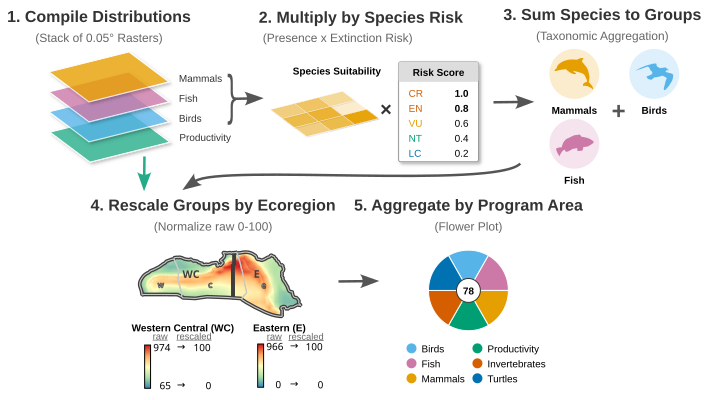

# Introduction

```{r}
#| include: false
# knitr evaluates inline `r ...` only in a document that has at least one code
# chunk. Without this, the doc_*() calls below render as LITERAL TEXT — which is
# exactly what happened when the old stats.R setup chunk was removed.
```


The Marine Sensitivity Toolkit (MST) is a cloud-native system developed for [BOEM](https://boem.gov) (Bureau of Ocean Energy Management) to assess the sensitivity of marine species to offshore energy development, whether oil & gas or wind. The Outer Continental Shelf Lands Act (OCSLA), Section 18(a)(2)(G), mandates that BOEM consider "the relative environmental sensitivity and marine productivity of different areas of the OCS" when planning the timing and location of offshore energy activities. The MST operationalizes this mandate by combining the best available species distribution data with extinction risk assessments to map areas of the ocean that are most sensitive to human activities.

The MST marks a significant advancement over prior RESA methodologies [@morandi2018]. Earlier approaches often relied on aggregated data from a limited set of broad species groups and surrogate species, lacking spatially explicit information for individual organisms. As a result, previous assessments were typically coarse and areawide, frequently missing critical ecological variation and fine-scale patterns across the OCS. In contrast, the MST uses a high-resolution 0.05° grid (~4 km per cell) on a species level to capture fine-scale conservation concerns and ecological patterns across US waters.

```{r}
#| label: intro-headline
#| output: asis

# Program Areas are a v2+ concept: v1 scored Planning Areas and its manifest says
# `programareas: false`. Stating the Program-Area subset unconditionally would put
# a 2026 program-cycle claim under a 2023 release.
cat("This book documents release **", doc_ver(), "**, which integrates **",
    doc_stat("valid_species"), " valid marine species** across **", doc_stat("n_datasets"),
    " source datasets** on a 0.05° grid (~4 km cells) covering the US Exclusive Economic Zone ",
    "study area", sep = "")
if (doc_can("programareas")) cat("; of these, **", doc_stat("species_program_areas"),
    "** have modeled distributions inside the **", doc_stat("n_program_areas"),
    " BOEM Program Areas** of the current program cycle", sep = "")
if (doc_can("planareas") && !doc_can("programareas")) cat(
    ", scored against the **", doc_stat("n_planning_areas"), " BOEM Planning Areas**", sep = "")
cat(". Every figure on these pages is read from that release's own published tables, so a page ",
    "never reports another version's numbers — see [Releases](releases.qmd) for how the releases ",
    "differ.\n\n", sep = "")
```

Species distributions are weighted by extinction risk scores that incorporate protections under the Endangered Species Act (ESA), Marine Mammal Protection Act (MMPA), and Migratory Bird Treaty Act (MBTA), as well as IUCN Red List assessments. The merged distribution of sensitivity per species is masked to expert ranges where available — species whose global range maps fall entirely outside the US EEZ are excluded, ensuring that only species with expert-confirmed presence in US waters contribute to scores.

This is a process, not a product. Information is imperfect, especially given the large expanse of US waters. Distributions and abundance of species change, modified increasingly by climate change and human activities. Knowledge on species sensitivities continues to expand with more research. Methods for both modeling and distributing this information continue to improve. In alignment with [Executive Order 14303](https://www.whitehouse.gov/presidential-actions/2025/01/restoring-gold-standard-science-in-the-federal-government/), we aim to provide a transparent and reproducible process that can be regularly updated as new data and methods become available.

## Overview

The MST analytical pipeline proceeds through the following stages (@fig-process):

1. **Data sources** (@sec-data-sources): `r doc_stat("n_datasets")` datasets of species distributions — continuous suitability models, regulatory habitat designations and expert range maps
2. **Taxonomy matching** (@sec-taxonomy): source names resolved to one canonical identity — BirdLife for birds, WoRMS for everything else — so models of the same species merge instead of double-counting it
3. **Model merging** (@sec-model-merging): one surface per taxon, with the expert range constraining suitability predictions and the governing extinction risk applied to the range cells
4. **Cell scoring** (@sec-scoring): extinction-risk-weighted species presence, summed within each scored species category
5. **Ecoregional rescaling**: scores normalized to 0--100 within each BOEM Ecoregion, so richness alone does not decide the ranking
6. **Zone aggregation**: area-weighted means to the spatial units the release scored
7. **Visualization** (@sec-apps): flower plots, treemaps and the interactive map applications

```{mermaid}
%%| label: fig-process
%%| fig-cap: "Flowchart of the MST analytical pipeline: from source datasets and taxonomic matching through model merging, scoring, and visualization."
%%| file: diagrams/process.mmd
%%| fig-width: 6
```

@fig-overview illustrates the full methodology at a glance. On the left, species distribution data flows in from the source datasets and the taxonomic authorities. In the center, models are merged per species and weighted by extinction risk scores derived from ESA, MMPA, MBTA, and IUCN regulatory frameworks. On the right, cell-level scores are rescaled within BOEM ecoregions and aggregated to program areas for visualization in the interactive mapping applications.

{#fig-overview}
