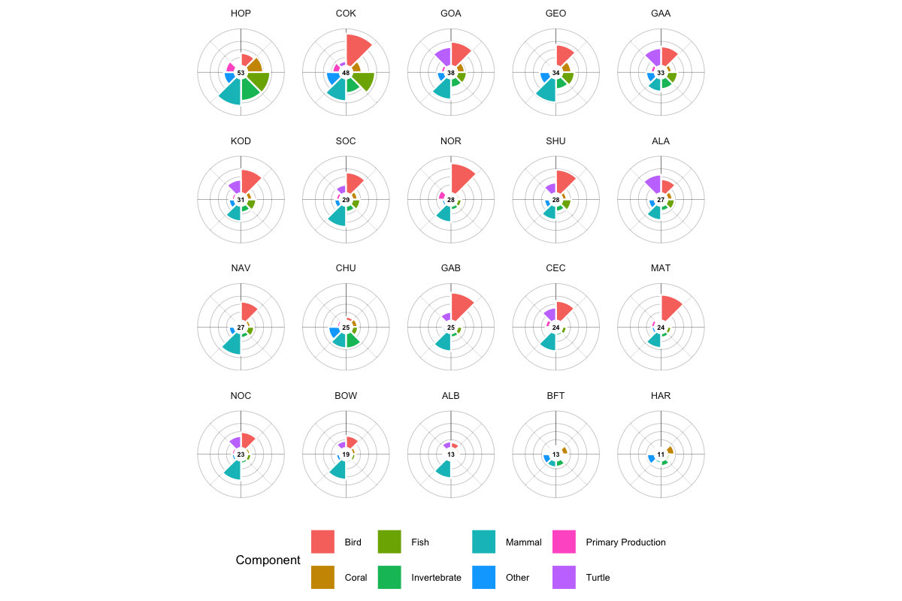
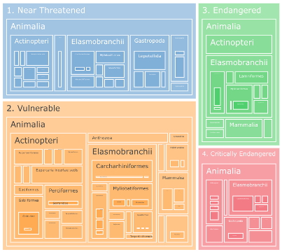
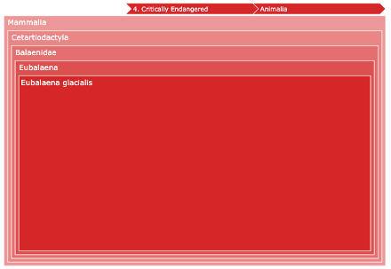

# Scoring {#sec-scoring}

The scoring methodology translates merged species distribution models and extinction risk weights into cell-level sensitivity metrics, which are then rescaled and aggregated to management zones for decision support.

## Cell-Level Scoring

For each grid cell, sensitivity is computed as the extinction risk weighted sum of species presence within each species category (@eq-cell-score):

$$
\text{score}_{c,g} = \sum_{s=1}^{S_g} \frac{\text{er\_score}_s \times v_{s,c}}{100}
$$ {#eq-cell-score}

where:

- $\text{score}_{c,g}$ = sensitivity score for cell $c$ and species category $g$
- $\text{er\_score}_s$ = extinction risk score for species $s$ (1--100; see @sec-extinction-risk)
- $v_{s,c}$ = merged model value for species $s$ in cell $c$ (0--100%; see @sec-model-merging)
- $S_g$ = number of valid species in category $g$

Division by 100 converts the product from a 0--10,000 range back to a 0--100 scale.

In plain terms, for each cell in the ocean the MST adds up the sensitivity contributions of all species found there. If a cell has many species that are both likely to be present and at high risk of extinction, it gets a higher sensitivity score. This helps identify places where rare or threatened species are concentrated.

## Metric Keys

Cell-level scores are stored as named metrics in the DuckDB database:

| Metric Key | Description |
|:-----------|:------------|
| `extrisk_bird` | extinction risk score for birds |
| `extrisk_coral` | extinction risk score for corals |
| `extrisk_fish` | extinction risk score for fishes |
| `extrisk_invertebrate` | extinction risk score for invertebrates |
| `extrisk_mammal` | extinction risk score for marine mammals |
| `extrisk_reptile` | extinction risk score for reptiles/turtles |
| `extrisk_other` | extinction risk score for other marine organisms |
| `primprod` | primary productivity (VGPM, metric tons C km^-2^ yr^-1^) |

: Cell-level metric keys stored in the MST database. {#tbl-metrics}

## Ecoregional Rescaling

Raw cell scores vary naturally across ecoregions due to differences in species richness, oceanographic conditions, and biogeographic patterns. To enable meaningful comparison, each metric is rescaled to a [0--100] range within each BOEM Ecoregion:

$$
\text{score}'_{c} = \frac{\text{score}_{c} - \text{score}_{min}}{\text{score}_{max} - \text{score}_{min}} \times 100
$$ {#eq-ecoregion-rescale}

where $\text{score}_{min}$ and $\text{score}_{max}$ are the minimum and maximum cell values for that metric within the Ecoregion.

**Scores are relative within Ecoregions, not absolute.** A score of 100 represents the most sensitive 0.05° cell for a given metric within a given BOEM Ecoregion---not globally. The final score is an equally weighted average of these ecoregionally rescaled metrics. This means that a score of 30 in Alaska reflects a different ecological context than a score of 30 in the Pacific.

**Why rescale by Ecoregion?** Without this step, areas with naturally higher numbers of species (like upwelling zones in the Pacific) would almost always receive the highest scores, simply because they have more species. While more species may indicate greater ecological importance, it could also be argued that the fewer species in an ecosystem, the more important each is to its function and resilience. Rescaling by Ecoregion prevents scores from being overwhelmed by species-rich areas. However, comparing *across* Ecoregions would require developing a mathematical relationship between these competing arguments for sensitivity---one that is still a source of earnest academic debate. For this reason, **scores are directly comparable among Program Areas within the same Ecoregion, but should not be compared across Ecoregions**.

### Geographic Scope

The current analysis covers 20 BOEM Program Areas from the 11th National Draft Proposed Program (2025) spanning Alaska, the Pacific, and the Gulf of America (@fig-map-ecoregions-scoring). The Atlantic OCS region is not included in this program cycle, so ecoregions without Program Areas (e.g., Northeast Continental Shelf, Southeast Continental Shelf, Washington/Oregon) are excluded from the analysis. Species whose distributions do not overlap with any Program Area will not appear in the interactive mapping applications.

### Cross-Ecoregion Program Areas

The Gulf of America Program Areas---GOA Program Area A (GAA) and GOA Program Area B (GAB)---span parts of two Ecoregions: Western and Central Gulf of America (WCGOA) and Eastern Gulf of America (EGOA). Because cell scores are rescaled within each Ecoregion before aggregation, cells in GAA that fall within the WCGOA Ecoregion are rescaled relative to WCGOA min/max values, while cells within EGOA use EGOA min/max values. The aggregated Program Area score is then the area-weighted average across all constituent cells, regardless of which Ecoregion they belong to. This approach ensures that the rescaling reflects local ecological context even when a Program Area spans Ecoregion boundaries. See `calc_scores.qmd` for implementation details.

```{r}
#| label: fig-map-ecoregions-scoring
#| fig-cap: !expr caption_ecoregions()
map_ecoregions()
```

## Primary Productivity Scoring

Net primary productivity (NPP) from the VGPM satellite model is included as a separate metric (`primprod`) that does not undergo extinction risk weighting. Instead, the raw NPP values (metric tons C km^-2^ yr^-1^) are directly rescaled within each ecoregion using the same [0--100] normalization.

## Zone Aggregation

Rescaled cell scores are aggregated to three spatial levels using area-weighted averaging:

1. **Program Areas**: the 20 BOEM planning regions used for offshore energy management
2. **Subregions**: intermediate spatial groupings (e.g., Atlantic, Gulf of America, Pacific, Alaska)
3. **Ecoregions**: BOEM-defined ecological regions used as the rescaling baseline

For each zone, the aggregated score is:

$$
\text{score}_{zone} = \frac{\sum_{c \in zone} \text{score}'_c \times A_c}{\sum_{c \in zone} A_c}
$$ {#eq-zone-agg}

where $A_c$ is the area of cell $c$ (accounting for latitude-dependent cell size in the 0.05° grid).

## Visualization

### Flower Plot

The flower plot provides an intuitive summary of sensitivity scores by species category, inspired by the Ocean Health Index [@halpern2012] visualization approach:

- **Petal length** represents the rescaled sensitivity score (0--100) for each species category — longer petals indicate higher sensitivity
- **Petal width** represents the weight of each category contributing to the overall score — wider petals have more influence on the center score
- **Center value** shows the weighted mean across all categories

@fig-flower-programareas shows flower plots for all 20 BOEM Program Areas. Each flower summarizes the sensitivity profile of one program area with petals for Bird, Coral, Fish, Invertebrate, Mammal, Other, Turtle, and Primary Production. Alaska program areas (e.g., HOP, COK, GOA) show dominant Fish and Mammal petals, while Gulf areas (GAB, CEC, MAT) show stronger Invertebrate and Coral contributions.

{#fig-flower-programareas}

The flower plot lets decision-makers quickly spot which ecological elements drive sensitivity in an area, aiding better planning and impact assessment.

The flower plot is implemented as an interactive `ggiraph` visualization using polar coordinates in R (`ggplot2 + coord_polar()`), with tooltips showing detailed score breakdowns on hover. The `plot_flower()` function in `calc_scores.qmd` generates static versions for reports, while the mapgl web application implements an interactive JavaScript version for responsive rendering (see @fig-mapgl-flower).

### Treemap

The treemap provides a detailed, hierarchical view of species contributions to sensitivity scores (@fig-treemap):

- Audience: scientists and analysts
- Shows the contribution of each species to the overall score within a pixel or management zone
- Elements are hierarchical: first by extinction risk category, then by taxonomic classification
- Interactive zooming allows drilling down to individual species contributions

{#fig-treemap}

Zooming into a specific category reveals individual species contributions:

{#fig-treemap-zoom}

### Interactive Maps

The primary visualization tools are two Shiny web applications:

- **[mapgl](https://shiny.marinesensitivity.org/mapgl/)**: general sensitivity mapping app showing composite scores by program area with flower plots and treemaps (see [Appendix: mapgl](apps/mapgl.qmd))
- **[mapsp](https://shiny.marinesensitivity.org/mapsp/)**: species distribution viewer showing individual and merged models with regulatory status information (see [Appendix: mapsp](apps/mapsp.qmd))
