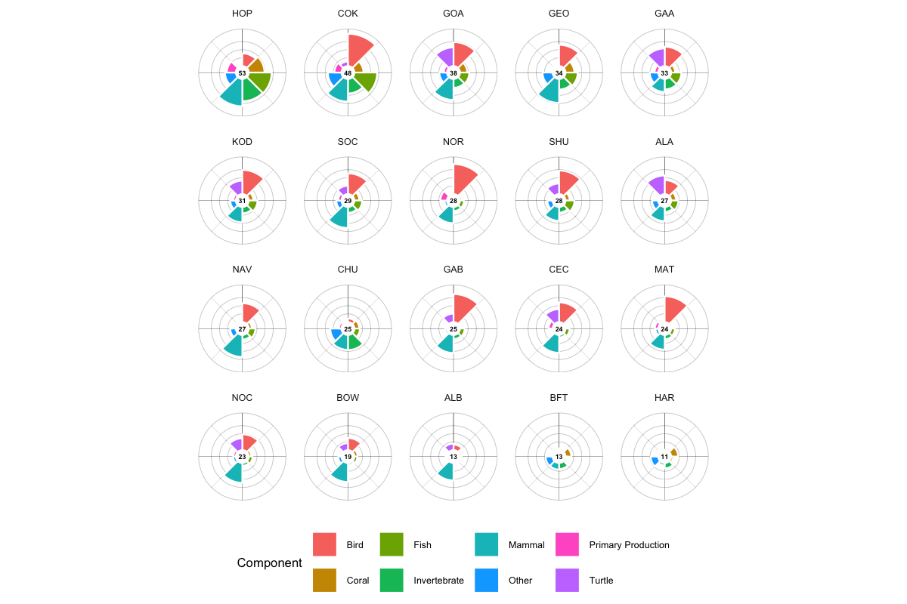
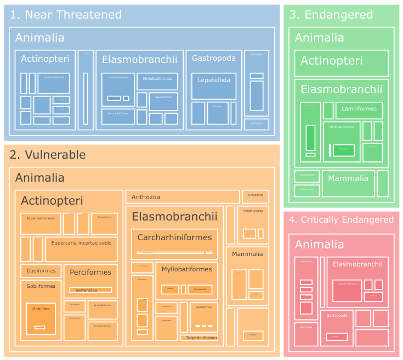
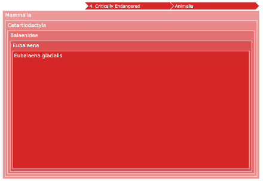

# Scoring {#sec-scoring}

```{r}
#| include: false
library(dplyr)
cats  <- doc_sp_cats()
zones <- doc_zones()
```

Scoring turns merged species distributions and extinction-risk weights into per-cell sensitivity metrics, which are then rescaled within ecoregions and aggregated to management zones.

::: {.callout-tip}
## Interactive walkthrough

The [Scoring Walkthrough](scoring-walkthrough.qmd) animates this pipeline — input rasters, merge, ecoregional rescaling and component averaging, step by step.
:::

## Cell-level scoring

For each cell, sensitivity is the extinction-risk-weighted sum of species presence within a species category:

$$
\text{score}_{c,g} = \sum_{s=1}^{S_g} \frac{\text{er\_score}_s \times v_{s,c}}{100}
$$ {#eq-cell-score}

where $\text{score}_{c,g}$ is the score for cell $c$ and category $g$; $\text{er\_score}_s$ is species $s$'s extinction-risk weight (1–100, @sec-extinction-risk); $v_{s,c}$ is the merged model value for that species in that cell (0–100, @sec-model-merging); and $S_g$ is the number of valid species in the category. Dividing by 100 returns the product to a 0–100 scale.

In plain terms: for every cell the MST adds up the contributions of the species found there. A cell holding many species that are both likely present and at high risk scores higher — which is how places where rare or threatened species concentrate are identified.

### Two exceptions: species whose risk varies across the range

For sea turtles, extinction risk is already inside the merged values via the multiplicative merge (@sec-model-merging), so the formula collapses to a plain sum:

$$
\text{score}_{c,g} = \sum_{s=1}^{S_g} v_{merged,s,c}
$$ {#eq-cell-score-turtle}

`er_score = 100` acts as a pass-through multiplier that cancels against the division. Cells inside an Endangered DPS therefore contribute more than cells inside a Threatened one, for the same species at the same suitability.

For the NMFS DPS-listed species (the humpback whale, Southern Resident killer whale, salmonid ESUs, …) the merged value is the suitability alone and the risk is a **per-cell** weight carried beside it, so the species-level `er_score` is replaced by the cell's:

$$
\text{score}_{c,g} = \frac{1}{100} \sum_{s=1}^{S_g} er_{s,c} \times v_{s,c}
$$ {#eq-cell-score-dps}

Numerically this is the turtle product taken one step later; the difference is that the merged model these species publish is their distribution, not their risk-weighted distribution. Each taxon's rule is recorded as `er_mode` in the scoring `taxon` table (`taxon` — the scalar weight; `premultiplied` — sea turtles; `cell` — DPS-listed species).

## Metrics

```{r}
#| label: tbl-metrics
#| tbl-cap: !expr paste0("Cell-level metrics published by ", doc_ver(), ". Each has an ecoregionally rescaled counterpart, and the composite is their equally weighted mean.")

m <- doc_manifest()$metrics
if (is.data.frame(m) && nrow(m)) {
  mm <- m |> distinct(metric_key, .keep_all = TRUE) |> arrange(metric_key)
  knitr::kable(
    data.frame(Metric      = paste0("`", mm$metric_key, "`"),
               Description = if ("description" %in% names(mm)) mm$description else "",
               check.names = FALSE, row.names = NULL),
    align = c("l", "l"))
}
```

```{r}
#| label: metrics-note
#| output: asis

sc <- cats$sp_cat[cats$scored]
cat("One extinction-risk metric exists per **scored** species category — ",
    paste0("`", sc, "`", collapse = ", "),
    " — plus primary productivity, which carries no extinction-risk weighting.\n\n", sep = "")
```

## Ecoregional rescaling

Raw cell scores vary naturally between ecoregions, through differences in species richness, oceanography and biogeography. Each metric is therefore rescaled to 0–100 **within each BOEM Ecoregion**:

$$
\text{score}'_{c} = \frac{\text{score}_{c} - \text{score}_{min}}{\text{score}_{max} - \text{score}_{min}} \times 100
$$ {#eq-ecoregion-rescale}

with the minimum and maximum taken over that metric's cells within the ecoregion.

::: {.callout-important}
## Scores are relative within an ecoregion, never absolute

A score of 100 marks the most sensitive cell for that metric **within that ecoregion** — not globally. A 30 in Alaska and a 30 in the Pacific describe different ecological contexts.

Scores are therefore directly comparable **among Program Areas within one ecoregion**, and should **not** be compared across ecoregions.
:::

**Why rescale at all?** Without it, naturally species-rich areas would almost always score highest simply for holding more species. More species may well indicate greater ecological importance — but it can equally be argued that the fewer species an ecosystem has, the more each one matters to its function and resilience. Rescaling within ecoregions keeps scores from being dominated by richness. Comparing *across* ecoregions would require settling that argument with a mathematical relationship between the two views, which remains a live academic debate.

## Spatial units

```{r}
#| label: tbl-zones
#| tbl-cap: !expr paste0("Spatial units ", doc_ver(), " scored, with the geometry vintage each used.")

if (nrow(zones)) {
  nm <- c(programarea_key = "BOEM Program Area", ecoregion_key = "BOEM Ecoregion",
          subregion_key = "Subregion", planarea_key = "BOEM Planning Area")
  knitr::kable(
    data.frame(
      Unit    = ifelse(zones$fld %in% names(nm), nm[zones$fld], zones$fld),
      Field   = paste0("`", zones$fld, "`"),
      Count   = n_fmt(zones$n),
      Vintage = if ("zone_set_key" %in% names(zones)) paste0("`", zones$zone_set_key, "`") else "—",
      check.names = FALSE, row.names = NULL),
    align = c("l", "l", "r", "l"))
}
```

```{r}
#| label: zones-note
#| output: asis

if (doc_can("planareas") && !doc_can("programareas")) cat(
  "::: {.callout-note}\n## Planning Areas, not Program Areas\n\n",
  doc_ver(), " predates the BOEM Program Areas of the 2026 program cycle and scores **Planning ",
  "Areas** instead. Sections elsewhere in this book that discuss Program Areas do not apply to ",
  "this release.\n:::\n\n", sep = "")

cat("Geometry is versioned by its own **vintage** rather than by release, so several releases ",
    "legitimately share one boundary set — one Program Area geometry covers v2 through v8, and ",
    "one ecoregion geometry covers every release. Each release's manifest names the vintage it ",
    "used, which is what lets this book draw the correct outlines for the version it documents ",
    "instead of the newest ones.\n\n", sep = "")
```

### Geographic scope

```{r}
#| label: scope
#| output: asis

if (doc_can("programareas")) cat(
  "The analysis covers **", doc_stat("n_program_areas"), " BOEM Program Areas** from the 11th ",
  "National Draft Proposed Program (2025), spanning Alaska, the Pacific and the Gulf of America. ",
  "The Atlantic OCS is not part of this program cycle, so ecoregions containing no Program Area ",
  "are outside the scored footprint.\n\n", sep = "")
```

The Gulf of America Program Areas (GAA and GAB) each span two ecoregions — Western and Central Gulf of America, and Eastern Gulf of America. Because rescaling happens *before* aggregation, cells are rescaled against their own ecoregion's range, and the Program Area score is then the area-weighted mean across all its cells regardless of ecoregion. Local ecological context is preserved even where a Program Area crosses a boundary.

```{r}
#| label: fig-map-ecoregions-scoring
#| fig-cap: !expr caption_ecoregions()
map_ecoregions()
```

## Primary productivity

Net primary productivity from the VGPM satellite model enters as its own metric (`primprod`), without extinction-risk weighting. The raw values (metric tons C km^-2^ yr^-1^) are rescaled within each ecoregion on the same 0–100 basis as everything else.

## Zone aggregation

Rescaled cell scores are aggregated to each spatial unit by area-weighted mean:

$$
\text{score}_{zone} = \frac{\sum_{c \in zone} \text{score}'_c \times A_c}{\sum_{c \in zone} A_c}
$$ {#eq-zone-agg}

where $A_c$ is the area of cell $c$ — which is latitude-dependent on a 0.05° grid, so the weighting is not cosmetic.

## Visualization

### Flower plot

The flower plot summarizes a zone's sensitivity profile by category, after the Ocean Health Index [@halpern2012]:

- **petal length** — the rescaled score (0–100) for that category; longer means more sensitive
- **petal width** — that category's weight in the composite; wider means more influence
- **centre** — the weighted mean across categories

{#fig-flower-programareas}

It lets a reader see at a glance which ecological elements drive sensitivity in an area. The scores app implements an interactive version.

### Treemap

The treemap shows how individual species contribute to a score, nested first by extinction-risk category and then by taxonomy, with zoom down to single species.

{#fig-treemap}

{#fig-treemap-zoom}

### Score rasters

```{r}
#| label: cogs
#| output: asis

if (doc_can("score_cogs")) cat(
"Cell-level scores are published as **Cloud-Optimized GeoTIFFs**, one per metric x subregion, with
the manifest carrying each raster's URL and its build-time rescale range. The map reads those
directly.

This replaced a tile factory that ran SQL against the database on every tile request. The rasters
were verified byte-identical to the factory's output before the switch. They are stored **without
overviews** deliberately: the renderer decimates from full resolution per request, so a
pre-built pyramid would disagree with it at low zoom.\n\n", sep = "")
```

### Interactive maps

Two Shiny applications present the results, each rendering **any published release** from a `?ver=` parameter rather than being frozen to one:

- **[Scores](`r doc_app_url("scores")`)** — composite and per-category sensitivity by zone, with flower plots and treemaps (see @sec-app-scores)
- **[Species](`r doc_app_url("species")`)** — individual and merged distribution models with regulatory status (see @sec-app-species)

Append `?ver=v3` (or any published version) to view that release. See @sec-apps.

## Implementation

Scoring runs in the `score_zones`, `score_cell_metrics` and `score_zone_metrics` workflows (@sec-workflows). Whole-pipeline equivalence between releases is checked by `msens::pra_score_delta`, which compares Program-Area scores on the species the two releases share.
