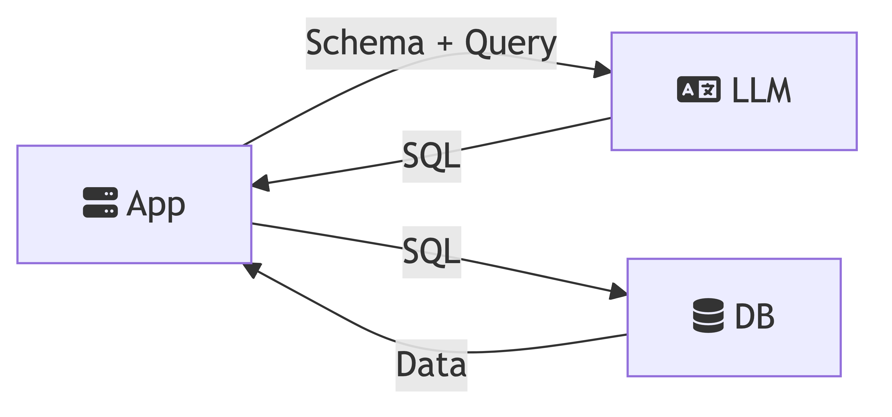
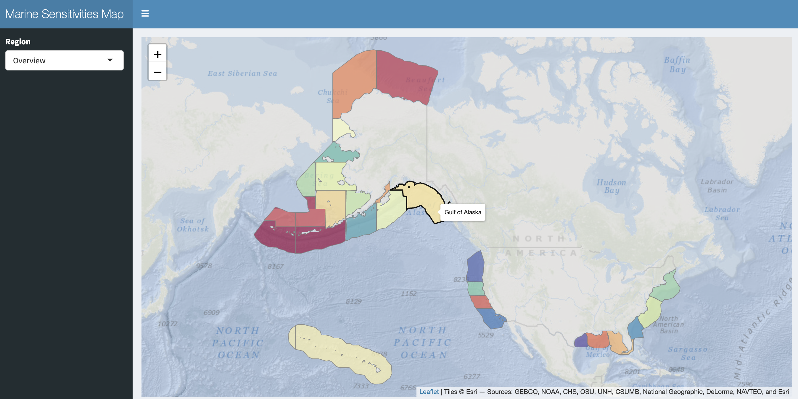
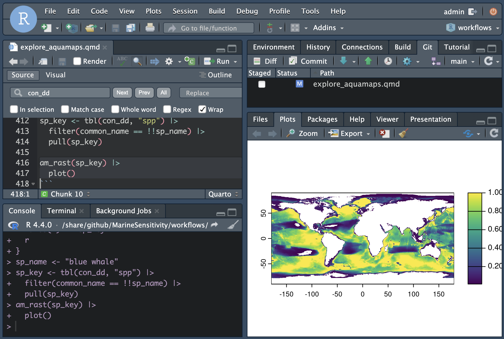
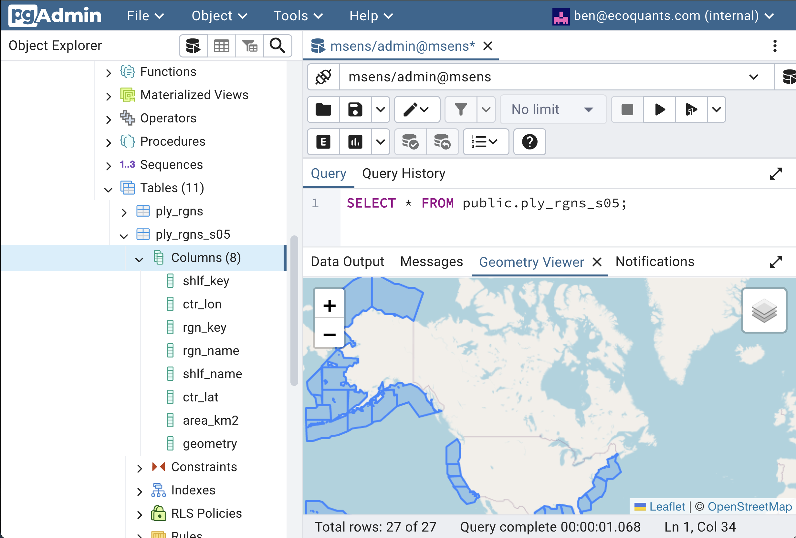

# Server {#sec-server}

The server is for serving up any web services outside those of Github (e.g., [website](https://marinesensitivity.org/), [docs](https://marinesensitivity.org/docs) and R package [msens](https://marinesensitivity.org/msens)) using [Docker](https://www.docker.com/) (see the [docker-compose.yml](https://github.com/MarineSensitivity/server/blob/main/docker-compose.yml); with reverse proxying from subdomains to ports by [Caddy](https://caddyserver.com)).

The full architecture is summarized in the [Software overview](software.qmd). This chapter documents the concrete services running on the host and how Caddy maps subdomains to container ports.

<!--
{#fig-arch}

{#fig-fa-example}
-->

## Setup

For the latest instructions on launching an Amazon instance and installing the server software, see [Server Setup · MarineSensitivity/server Wiki](https://github.com/MarineSensitivity/server/wiki/Server-Setup), which is pasted below for convenience...



## Docker compose

The Docker compose file is used to define and run multi-container Docker applications. Here is the [`docker-compose.yml`](https://github.com/MarineSensitivity/server/blob/main/docker-compose.yml) file for the server pasted for convenience ...

``` yml

```

## DNS

The domain name server (DNS) records are managed by [SquareSpace](https://account.squarespace.com/domains). The subdomains point to the server on Amazon at `100.25.173.0`, whereas the main website is hosted by Github servers, per [Managing a custom domain for your GitHub Pages site - GitHub Docs](https://docs.github.com/en/pages/configuring-a-custom-domain-for-your-github-pages-site/managing-a-custom-domain-for-your-github-pages-site).

| Host      | Type  | Data                  |
|-----------|-------|-----------------------|
| \@        | A     | 185.199.111.153       |
| \@        | A     | 185.199.110.153       |
| \@        | A     | 185.199.109.153       |
| \@        | A     | 185.199.108.153       |
| api          | A     | 100.25.173.0          |
| app          | A     | 100.25.173.0          |
| file         | A     | 100.25.173.0          |
| msens1       | A     | 100.25.173.0          |
| pgadmin      | A     | 100.25.173.0          |
| pmtiles      | A     | 100.25.173.0          |
| rstudio      | A     | 100.25.173.0          |
| shiny        | A     | 100.25.173.0          |
| tile         | A     | 100.25.173.0          |
| tilecache    | A     | 100.25.173.0          |
| titiler      | A     | 100.25.173.0          |
| titilecache  | A     | 100.25.173.0          |
| www          | CNAME | marinesensitivity.org |

## Caddyfile

The Caddyfile parameterizes the reverse proxying between the external subdomains and the Docker's internal ports. Here is the [`Caddyfile`](https://github.com/MarineSensitivity/server/blob/main/caddy/Caddyfile) pasted for convenience ...

``` caddyfile

```

## Services

The server is running the following services. Subdomains with 🔒 are internal (admin / development); others are public.

### App + data plane

-   [**app**](https://app.marinesensitivity.org) / [**shiny**](https://shiny.marinesensitivity.org)\
    *interactive Shiny applications* (`scores`, `species`, ...) — proxied to the `rstudio` container's Shiny Server on internal port 3838\
    {width="300"}\
    [Shiny Server docs](https://shiny.posit.co/)

-   [**file**](https://file.marinesensitivity.org)\
    *static file server for PMTiles archives, report downloads, reference GeoPackages* — served by Caddy's `file_server` directive directly from the `/share` bind-mount. This replaces the old `pg_tileserv` vector-tile path for Program Areas, Ecoregions, Planning Areas, protractions, blocks and aliquots; each layer is a single `.pmtiles` file that the browser range-reads for only the tiles it needs.

-   [**titiler**](https://titiler.marinesensitivity.org) + [**titilecache**](https://titilecache.marinesensitivity.org) 🔒🟢\
    *custom msens [TiTiler](https://developmentseed.org/titiler/) factory fronted by a [Varnish](https://varnish-cache.org) cache.*\
    The factory exposes `/msens/*` routes that execute a validated SELECT against DuckDB, look the result up against a pre-baked cell-id COG, and return on-the-fly colorized PNG tiles (see @sec-apis). `titilecache` keys on the full URL (including base64 SQL) and caches each tile for 7 days with `default_keep=604800`; the custom VCL (`server/varnish/titiler.vcl`) normalizes query-param order via `std.querysort()` so semantically-identical URLs share a cache entry, strips cookies / authorization (the factory is stateless), and adds an `X-Cache: HIT | MISS` debug header.

-   [**api**](https://api.marinesensitivity.org)\
    *custom R [`plumber`](https://www.rplumber.io) API* for programmatic access to DuckDB — see @sec-apis\
    {width="300"}

### Admin

-   [**rstudio**](https://rstudio.marinesensitivity.org) 🔒\
    *integrated development environment (IDE) to code and debug directly on the server.*\
    {width="300"}\
    [Posit RStudio Server](https://posit.co/products/open-source/rstudio-server/)

-   [**pgadmin**](https://pgadmin.marinesensitivity.org) 🔒\
    *PostgreSQL database administration interface* — used for legacy apps that still connect to PostgreSQL (see below).\
    {width="300"}\
    [pgAdmin](https://www.pgadmin.org/)

### Legacy (carried for backward-compat; not in the critical path)

As of 2026-04, the new raster tile path (`titiler` + `titilecache`) and PMTiles-via-`file` replace what was previously handled by PostgreSQL + `pg_tileserv`. The **authoritative store is now DuckDB** (`/share/data/big/latest/sdm.duckdb`). The following services remain in `docker-compose.yml` only for backward compatibility with a small set of pre-2026 apps (`indicators`, `bird_hotspots`) that still read from PostgreSQL. New app code should target DuckDB + the TiTiler factory + PMTiles.

-   **postgis** (`postgis/postgis:latest`, internal 5432)\
    *PostgreSQL + PostGIS* — formerly the primary spatial database; now read by legacy apps only.
-   **tile** (`pramsey/pg_tileserv:latest`, internal 7800) + **tilecache** (Varnish, 6081)\
    *vector tiles from PostGIS tables* — superseded by static PMTiles served by Caddy.
-   **rest** and **swagger** — PostgREST + Swagger UI, both **commented out** in `docker-compose.yml`.

 <!-- init fontawesome to get in mermaid diagrams -->
