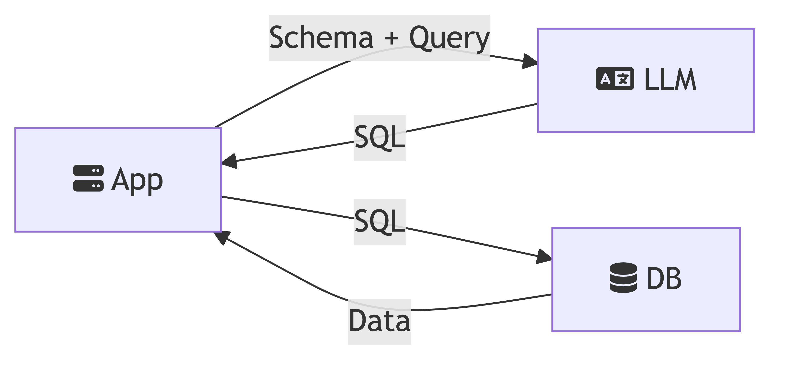
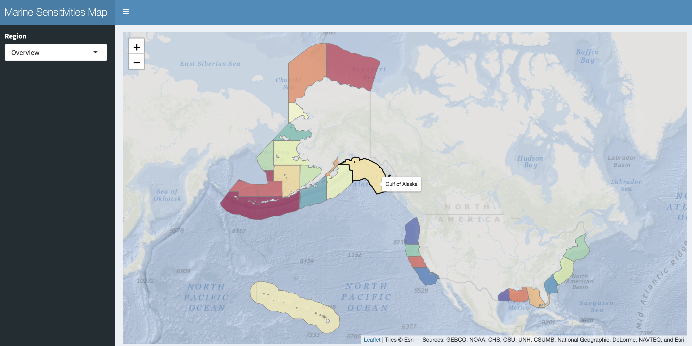
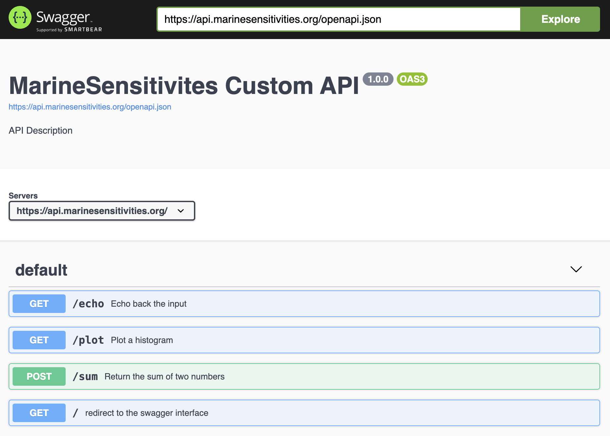
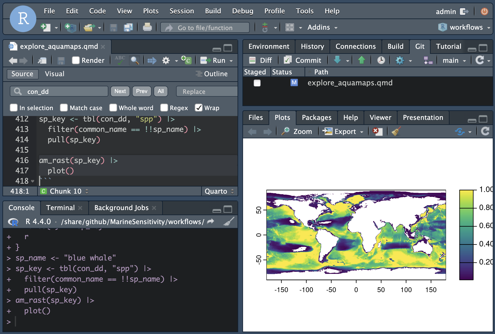

# Server {#sec-server}

The server is for serving up any web services outside those of Github (e.g., [website](https://marinesensitivity.org/), [docs](https://marinesensitivity.org/docs) and R package [msens](https://marinesensitivity.org/msens)) using [Docker](https://www.docker.com/) (see the [docker-compose.yml](https://github.com/MarineSensitivity/server/blob/main/docker-compose.yml); with reverse proxying from subdomains to ports by [Caddy](https://caddyserver.com)).

The full architecture is summarized in the [Software overview](software.qmd). This chapter documents the concrete services running on the host and how Caddy maps subdomains to container ports.

<!--
{#fig-arch}

{#fig-fa-example}
-->

## Setup

For the latest instructions on launching an Amazon instance and installing the server software, see [Server Setup · MarineSensitivity/server Wiki](https://github.com/MarineSensitivity/server/wiki/Server-Setup), which is pasted below for convenience...



## Docker compose

The Docker compose file is used to define and run multi-container Docker applications. Here is the [`docker-compose.yml`](https://github.com/MarineSensitivity/server/blob/main/docker-compose.yml) file for the server pasted for convenience ...

``` yml

```

## DNS

The domain name server (DNS) records are managed by [SquareSpace](https://account.squarespace.com/domains). The subdomains point to the server on Amazon at `100.25.173.0`, whereas the main website is hosted by Github servers, per [Managing a custom domain for your GitHub Pages site - GitHub Docs](https://docs.github.com/en/pages/configuring-a-custom-domain-for-your-github-pages-site/managing-a-custom-domain-for-your-github-pages-site).

| Host      | Type  | Data                  |
|-----------|-------|-----------------------|
| \@        | A     | 185.199.111.153       |
| \@        | A     | 185.199.110.153       |
| \@        | A     | 185.199.109.153       |
| \@        | A     | 185.199.108.153       |
| api          | A     | 100.25.173.0          |
| app          | A     | 100.25.173.0          |
| file         | A     | 100.25.173.0          |
| msens1       | A     | 100.25.173.0          |
| pgadmin      | A     | 100.25.173.0          |
| pmtiles      | A     | 100.25.173.0          |
| rstudio      | A     | 100.25.173.0          |
| shiny        | A     | 100.25.173.0          |
| tile         | A     | 100.25.173.0          |
| tilecache    | A     | 100.25.173.0          |
| titiler      | A     | 100.25.173.0          |
| titilecache  | A     | 100.25.173.0          |
| www          | CNAME | marinesensitivity.org |

## Caddyfile

The Caddyfile parameterizes the reverse proxying between the external subdomains and the Docker's internal ports. Here is the [`Caddyfile`](https://github.com/MarineSensitivity/server/blob/main/caddy/Caddyfile) pasted for convenience ...

``` caddyfile

```

## Services

The server is running the following services. Subdomains with 🔒 are internal (admin / development); others are public.

### App + data plane

-   [**app**](https://app.marinesensitivity.org) / [**shiny**](https://shiny.marinesensitivity.org)\
    *interactive Shiny applications* — proxied to the `rstudio` container's Shiny Server on internal port 3838. There are now **two** applications, `/scores` and `/species`, each rendering any published release from `?ver=`. The former per-version instances (`mapgl`, `mapsp`, `mapgl_v1`…`mapsp_v6`, `scores_v6`/`v8`, `species_v6`/`v8`) are retired, with Caddy issuing a **301 to the equivalent `?ver=`** so every existing link — including any printed in a published report — still resolves to the release it always showed.\
    {width="300"}\
    [Shiny Server docs](https://shiny.posit.co/)

-   [**file**](https://file.marinesensitivity.org)\
    *static file server for PMTiles archives, report downloads, reference GeoPackages* — served by Caddy's `file_server` directive directly from the `/share` bind-mount. This replaces the old `pg_tileserv` vector-tile path for Program Areas, Ecoregions, Planning Areas, protractions, blocks and aliquots; each layer is a single `.pmtiles` file that the browser range-reads for only the tiles it needs.

-   [**titiler**](https://titiler.marinesensitivity.org) + **titiler-v8** 🟢\
    *[TiTiler](https://developmentseed.org/titiler/) serving the published raster assets.*\
    Every map layer the applications draw is now a **pre-rendered Cloud-Optimized GeoTIFF** read through titiler's stock `/cog` routes — score surfaces per metric × subregion, and per-model distributions. `titiler-v8` runs in parallel with the v7 instance, reading a kilobyte-sized view-only DuckDB whose `model_cell` is a *view* over the partitioned Parquet on S3, so no multi-gigabyte database is copied to the server.

-   **titilecache** (Varnish) 🔒\
    Fronts the v7 `titiler` only. The v8 service is deliberately **not** proxied through it: an immutable COG is already cacheable by URL, and the one endpoint that would benefit is retired (below).

-   [**api**](https://api.marinesensitivity.org)\
    *custom R [`plumber`](https://www.rplumber.io) API* for programmatic access to DuckDB — see @sec-apis\
    {width="300"}

### Admin

-   [**rstudio**](https://rstudio.marinesensitivity.org) 🔒\
    *integrated development environment (IDE) to code and debug directly on the server.*\
    {width="300"}\
    [Posit RStudio Server](https://posit.co/products/open-source/rstudio-server/)

-   **pgadmin** 🔒 — *PostgreSQL administration interface*, commented out along with the PostgreSQL services it managed (see Retired, below).

### Retired

-   **The custom `/msens` tile factory** — kept in the image but **off by default**, behind `MSENS_FACTORY=1`.\
    It rendered a tile by executing a validated SELECT against DuckDB and looking the result up against a cell-id COG. Pre-rendered COGs replaced it: nothing reaches it any more, because every metric on every release now has a COG. The two paths were verified equivalent before the switch — 100 of 105 sample tiles byte-identical, the remainder differing by 3–6 pixels out of 262,144 from float32 storage. It remains available for exploratory on-the-fly queries.

-   **postgis**, **tile** (`pg_tileserv`), **tilecache**, **rest** (PostgREST) and **swagger** — all **commented out** in `docker-compose.yml` and **not running**. PostgreSQL is no longer part of any serving path; the authoritative store is DuckDB, with the published release as partitioned Parquet on S3. Vector geometry is served as static PMTiles by Caddy's `file` subdomain, and the `pgadmin` entry above is likewise vestigial.

 <!-- init fontawesome to get in mermaid diagrams -->
